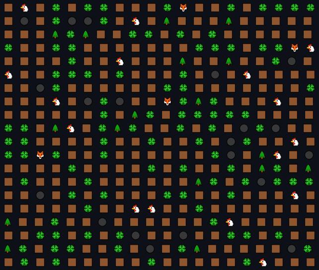

# Simulation Project

Created according to the technical specifications presented
in [this course](https://zhukovsd.github.io/java-backend-learning-course/Projects/Simulation/)

# Overview

The point of the project is a step-by-step simulation of a 2D world populated by herbivores and predators. In addition
to creatures, the world contains resources (grass), which the herbivores feed on, and static objects with which you
can't interact - they just fill the space.

### Implemented features:

- Creature actions:
    - `Herbivores` can either go towards the `Grass` or eat it
    - `Predators` can either go towards the `Herbivores` or eat them
- [Breadth-first search](https://en.wikipedia.org/wiki/Breadth-first_search) used as pathfinding algorithm
    - algorithm excludes stationary (`Tree` & `Rock`) objects from pathfinding
- `Renderer` displays the current state of the simulation in the console output
